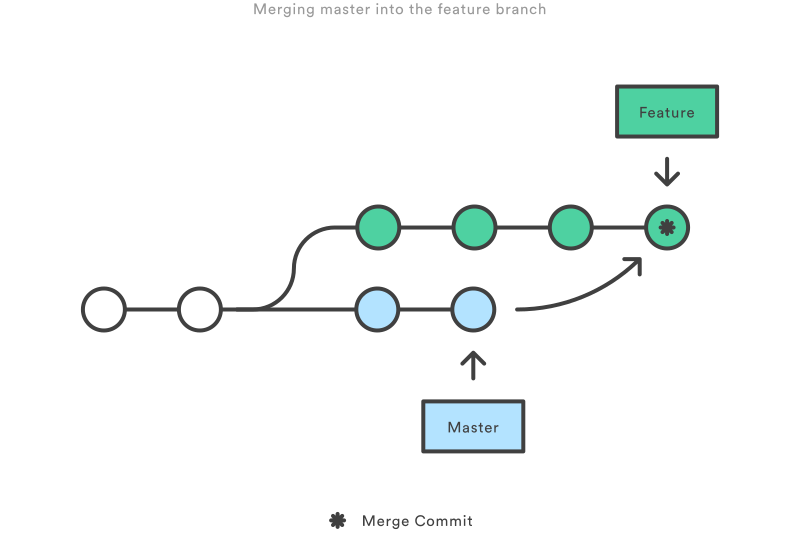
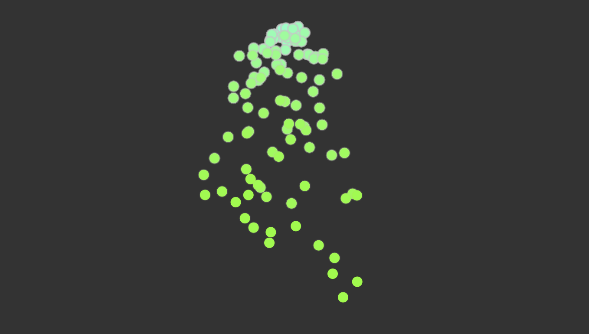

# Branching! 

#### Now We're gonna take some time and talk about why Git isn't just great for keeping copies of your files but also iterating and experiemnting 

Using branches allows you to maintain multiple different timelines of your git respository, essetnially turning you into a time traveler



As you can see in this image, when you "branch" you're taking the respository at the point it is at in time, and branching off creating a new version of the repo which can be safely developed.  

Let's look at this file I've included to see what the base looks like



You can open this file yourself by going to 

```
file:///Users/myname/{path_to_repo}/githubforartistsitpcamp/branching/mycoolparticles.html
```

Lets create our first branch

```
git checkout -b 'prettify'
```

Cool lets reload the page! We should see the same thing 

#### Making Changes

Okay now that we have our branch lets make some changes.  Lets open the file "mycoolparticles.html" in a text editor of your choice.  

* Lets change some of the variables that will make some obvious changes to the particle system.  

```buildoutcfg
        // CHANGE THESE PARAMETERS

        // Set value between 0-255
        let particleLifespan = 100;
        // Set value between 0-255
        let particleColorR = 127;
        // Set value between 0-255
        let particleColorG = 255;
        // Set value to true or false
        let useSquares = false;
```

Oh wow that looks great.  Lets create a new commit! 

```buildoutcfg
git add branching/mycoolparticles.html
git commit -m 'made things look GOOD'
git log

```

We can now see that the HEAD is set to our **prettify** branch.  Lets checkout the master branch again to make sure things haven't changed.

```buildoutcfg
git checkout master
```

Now lets open our page and see what happens, looks good right? We can switch back to the prettify branch and keep making changes, or we can decide that we want to take the changes we made on our branch and make those the new master version for the repo. We can do that with a simple command

```buildoutcfg
Matts-MacBook-Pro:GithubForArtistsITPCamp mattross$ git merge prettify
Updating 7271a8a..6f4bcfe
Fast-forward
 branching/mycoolparticles.html | 4 ++--
 1 file changed, 2 insertions(+), 2 deletions(-)
```

We can see that now if we look at the webpage you should now see our new changes!


Example adapted from
https://p5js.org/examples/simulate-particle-system.html
