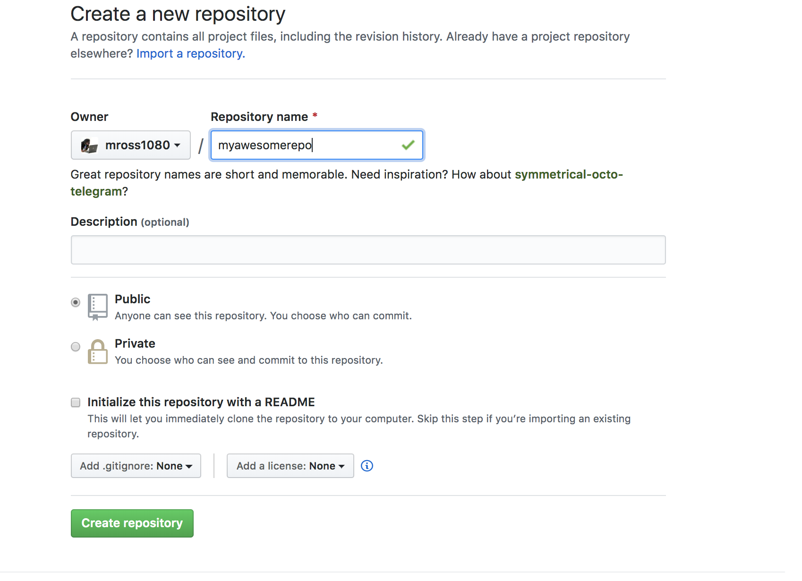

# Getting Started!


Here are the main commands you'll be working with

```
git status
git add {my file}
git commit -m 'commit message'
git push {repo origin} {branch of repository to push to}
```

* When I am done working on a file I "add" it
    * When you add a file, you "stage" it. This means git is now tracking that file and any changes you make to it.

* Then I "commit" it
    * When you commit a file you are saving the changes you made in that file with a specific index inside git: it will store these changes in its log of commits, which you can see anytime by typing `git log` into the command line. Committing regularly ensures that you have an easy-to-follow list of changes (and you can undo or remove commits without seriously damaging your codebase).

    * These changes are all stored locally, on your computer.
* Then I "push" it
    * Upload those changes to the remote repository. This will keep the changes stored in GitHub. You should push after every commit - this way, if your computer dies or something goes terribly wrong, your work will still be stored online.


#### Add.....Commit....Push....

#### Remote Repository?


Github may be the topic of today’s session but it all works through the git protocol.
A remote repository is just a copy of your work stored in a different place then where you are currently working.


## Steps


### 1. Create your own repo.


### 2. Give it a name!


### 3. Follow the instructions


In terminal, you can either manually initiate git and add this GitHub repo as a remote, following the first steps shown here, or you can simply go to the folder of your choice, copy the link at the top of the page, and enter git clone `your repo’s URL`. For this example, we’ll be following the “create a new repository on the command line” steps.

### 4. Go look at your new repo!


## Challenge!
* Add your favorite cat or dog picture to the repo and push it to github!

Remember the steps! On your local computer, go to this folder and copy an image into it, then return to the terminal.

```
git status
git add yourphoto.jpg
git commit -m 'changed some stuff'
git push origin master
```
