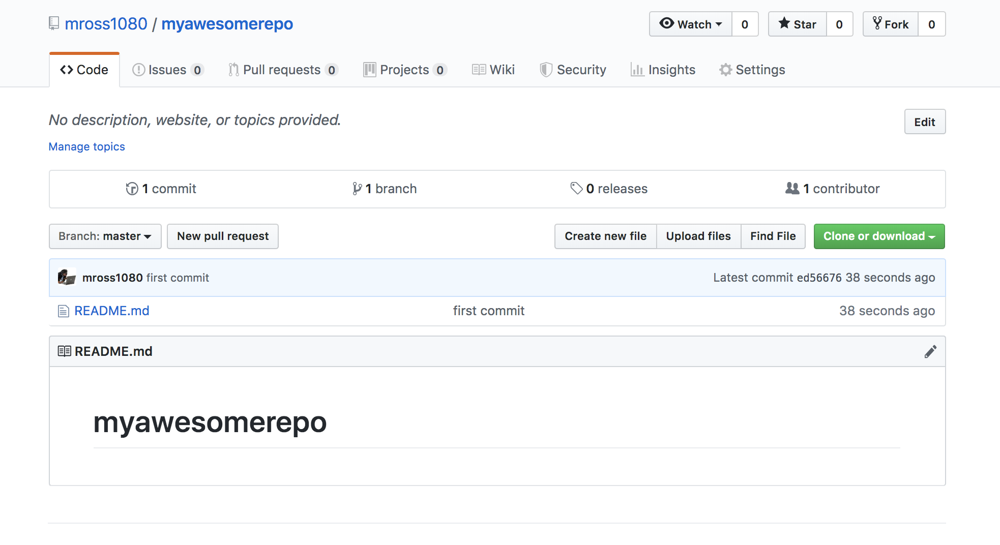

# Getting Started! 


Here are the main commands you'll be working with

```
git status
git add {my file}
git commit -m 'commit message'
git push {repo origin} {branch of repository to push to}
```

* When I am done working on a file I "add" it
    * When you Add a file, you "stage" it which means you are preparing it to be committed
* Then I "commit" it
    * When you commit a file you are associated the changes you made in that file with a specific index
    * You're making the changes to your 'local' repository 
* Then I "Push" it
    * Upload those changes to the remote repository


Add.....Commit....Push....

Remote Repository?


Github may be the topic of todays session but it all work's through the git protocol.
A remote repository is just a copy of your work stored in a different place then where you are currently working.  


Steps 


1. Create your own repo.  


2. Give it a name!


3. Follow the instructions


4. Go look at your new repo!



# Challenge!
* Add your favorite cat or dog picture to the readme and push it to github!

remember the steps!


```
git status
git add README.md
git commit -m 'changed some stuff'
git push origin master
```